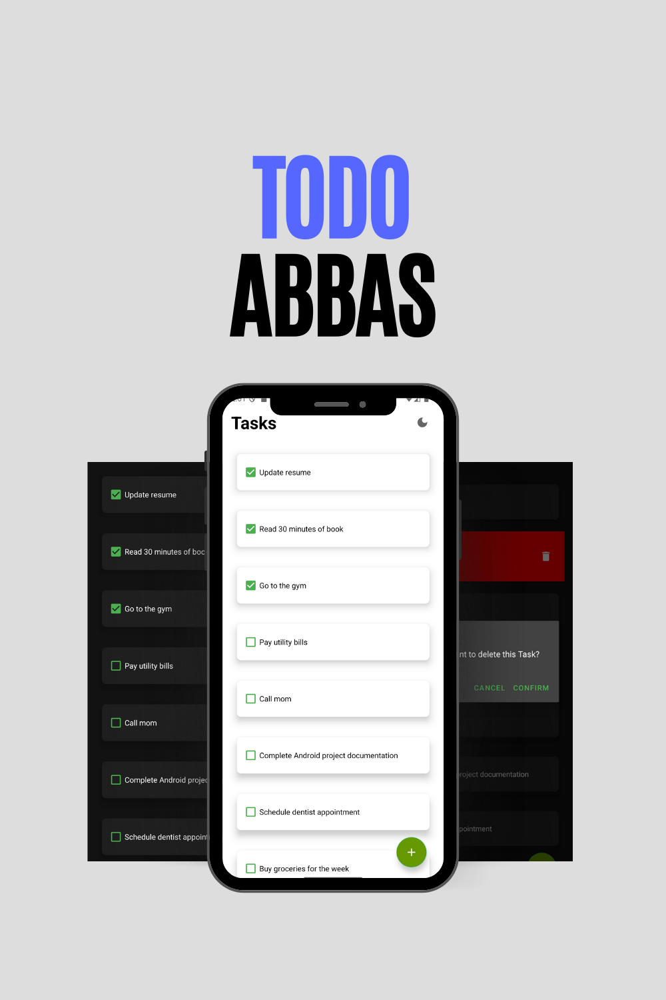

# Todo Abbas

A modern Android todo list application with dark mode support and material design.

## Preview

## Features

- Create, edit, and delete tasks
- Swipe actions for quick edit/delete
- Dark/Light theme toggle
- Material Design UI
- Local SQLite database storage
- Smooth animations and transitions

## Technical Details

### Core Components
- **Language**: Java
- **Database**: SQLite
- **Minimum SDK**: API 21 (Android 5.0)

### Libraries & Components
- Material Design Components
- RecyclerView with custom adapter
- BottomSheetDialog for task creation/editing
- CardView for task items
- SQLite for data persistence
- SharedPreferences for theme storage

## Getting Started

1. Clone the repository
2. Open the project in Android Studio
3. Build and run the application

## Requirements

- Android 5.0 (API level 21) or higher
- Android Studio 4.0 or higher

## License

This project is licensed under the MIT License - see the LICENSE file for details

## Demo

https://github.com/Omar7001-B/TodoAbbas/raw/main/Screenshots/v1.0.0/demo.mp4
